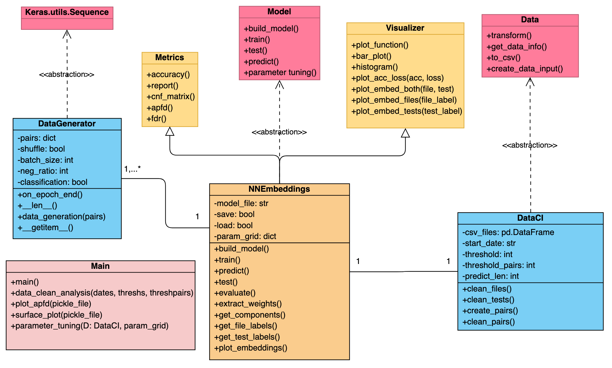

# NNE-TCP

NNE-TCP - Neural Network Embeddings for Test Case Prioritization - is a Machine Learning tool developed in Python for Continuous Integration systems. It aims to reduce the feedback-loop between making a commit and knowing if it was successfuly merged into the mainline, by prioritizing more relevant tests.

* Finds relations between **Modified-Files** and **Test-Case** from historical data.
* Embeddings enable **Entity Representation**, grouping in the embedding space elements that are similar.
* **Lightweight** 
* **Modular** to fit different system configurations.

## Summary: 
OOP-Scheme takes raw CI Data, transforms it and cleans it. By reimplementing the Keras DataGenerator class, we can generate new batches of data on-the-fly, saving up memory.
  Then the data is used to feed a Neural Network Embedding Machine Learning Model that will be used to make predictions on unseen data, i.e. make more meaningful test orderings to catch regressions quicker.  

## Class Scheme: 

Below we have the framework depicted in UML:

   
* **DataCI:** Inherits from Abstract Class Data. Takes raw data input, cleans it and transforms it into (file, test) pairs. 

* **NNEmbeddings:** Implements Abstract Class Model and inherits methods from Metrics and Visualizer and corresponds to the whole Machine Learning Framework.

* **DataGenerator:** Creates meaningful and balanced batches for machine learning model input.

* **Metrics:** Utility Class for Classification and Regression Metrics.

* **Visualizer:** Utility Class for Plotting several graphs.
