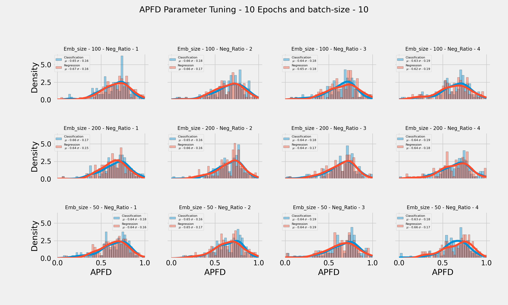
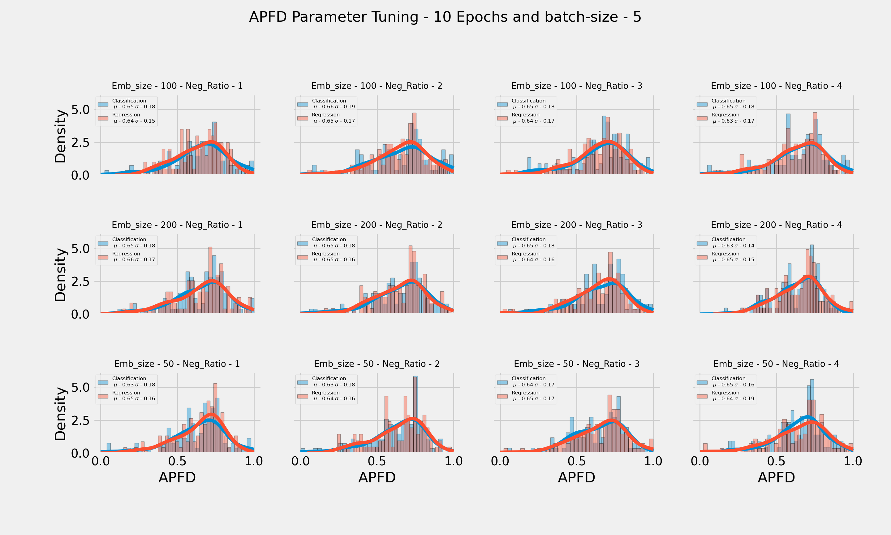
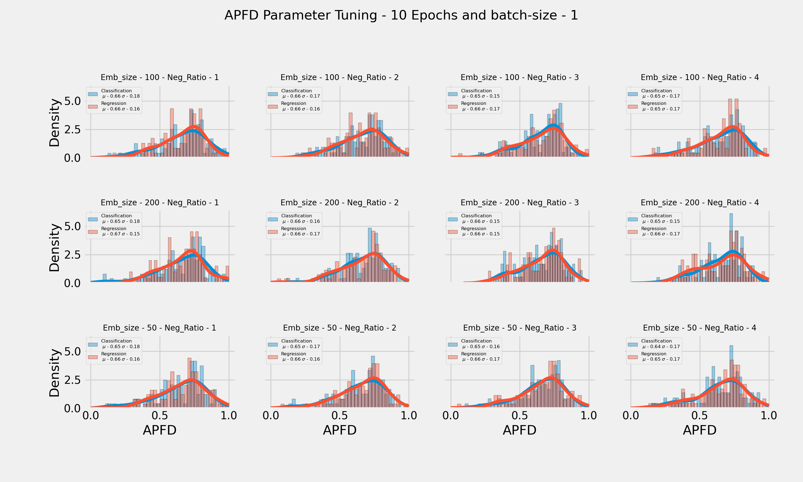
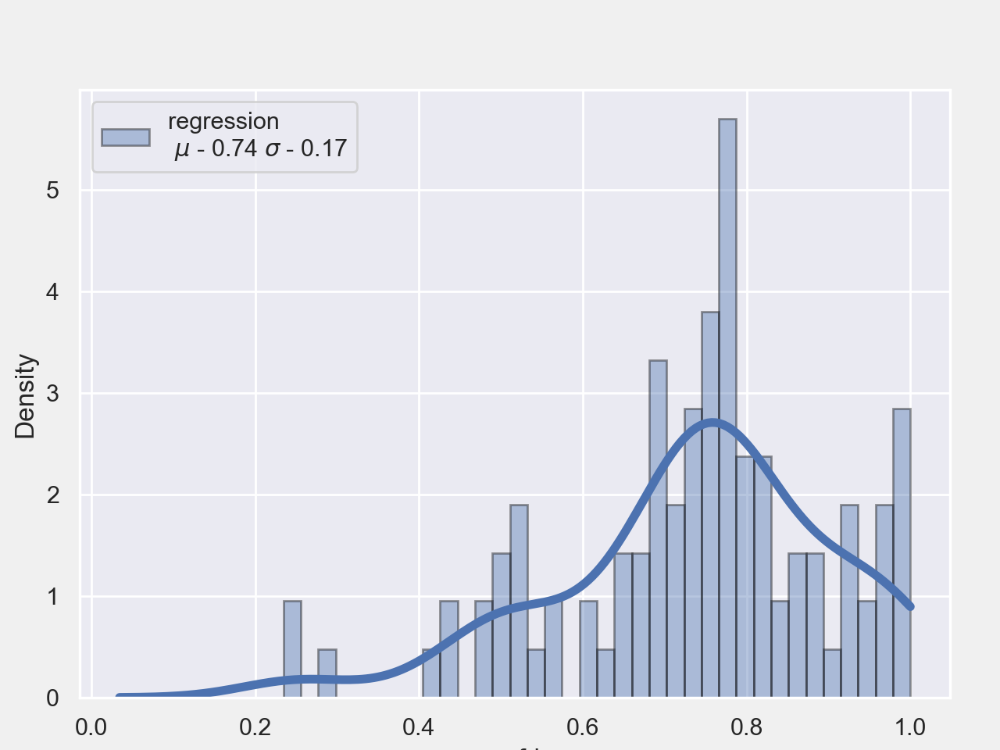

# NNE-TCP

NNE-TCP - Neural Network Embeddings for Test Case Prioritization - is a Machine Learning tool developed in Python for Continuous Integration systems. It aims to reduce the feedback-loop between making a commit and knowing if it was successfuly merged into the mainline, by prioritizing more relevant tests.

* Finds relations between **Modified-Files** and **Test-Case** from historical data.
* Embeddings enable **Entity Representation**, grouping in the embedding space elements that are similar.
* **Lightweight** 
* **Modular** to fit different system configurations.

## Summary: 
OOP-Scheme takes raw CI Data, transforms it and cleans it. By reimplementing the Keras DataGenerator class, we can generate new batches of data on-the-fly, saving up memory.
  Then the data is used to feed a Neural Network Embedding Machine Learning Model that will be used to make predictions on unseen data, i.e. make more meaningful test orderings to catch regressions quicker.  

## Class Scheme: 

Below we have the framework depicted in UML:

   
* **DataCI:** Inherits from Abstract Class Data. Takes raw data input, cleans it and transforms it into (file, test) pairs. 

* **NNEmbeddings:** Implements Abstract Class Model and inherits methods from Metrics and Visualizer and corresponds to the whole Machine Learning Framework.

* **DataGenerator:** Creates meaningful and balanced batches for machine learning model input.

* **Metrics:** Utility Class for Classification and Regression Metrics.

* **Visualizer:** Utility Class for Plotting several graphs.

## How it Works
* **Raw data is loaded and transformed:** missing values are removed, data types converted, file name strings are split.
* **Data Cleaning:** Some files present in the data are deprecated or unused. Thus we only want to keep relevant files. To do that, only files that have been modified recently are kept, otherwise are removed. Drops tests/files from data that cause less than threshold transitions/modifications, i.e. very stable tests/files.
* **ML Input:** Create unified input data for ML algorithm, where columns are (revision, mod_files (list)  and test names (list). Then we want to create pairs of the form (file, test). For each revision, the lists above are exploded to make pair-wise combinations between elements. Now we need to create a training set.
* **DataGenerator:** Generates data for Keras Model. Receives pairs of (files, tests) and generates random combinations of (file, test, label). Where the label is either 1 if the pair exists in the data or 0 otherwise. The class balance is given by the negative_ratio parameter, if parameter is 1, class balance is 50% each.
* **Keras Model:** Neural Network Embeddings depicted below.
* **Evaluation:** Once the model is trained. When new revisions arrive, it is able to predict which tests will more likely be linked to the modified files and create a more meaningful test ordering to detect faults earlier. The evaluation is done by the APFD (Average Percentage of Faults Detections) metric.

## Data Cleaning

Data Cleaning has 3 steps: the date from which we consider files, the individual frequency of each element - files that appear few times are likely to be irrelevant and not provide information - and, finally, the frequency of the pair itself - rare pairs may have occured by chance. 
To remove the noise from the data we want that the average number of occurences per file is larger - we want more density of relevant files and tests. Here's how this density varies with out parameters:

## Parameter Tuning 

There are many parameters to be configured in this framework: 

* **Embedding-Size:** Length of the vector that represents files and tests.
* **Negative-Ratio:** Proportionality of positive examples - the ones that occur in the data - and negative examples - the ones that do not occur in the data, for example, test that did not transition when that file was modified.
* **Task:** Choose task for Supervised Learning Problem, *Classification* or *Regression*.
* **Optimizer:** Optimizer for backpropagation algorithm. Default: 'Adam'
* **Batch-Size:** Each batch is composed by one or more revisions that have unequal length of pairs.
* **Epochs:** Number of passes through the whole dataset.

### Epochs: 10 - Batch-Size: 10

### Epochs: 10 - Batch-Size: 5

### Epochs: 10 - Batch-Size: 1

### Best Combination: 

**Score**: APFD = 0.67 ± 0.15

* **Embedding-Size:** 200
* **Negative-Ratio:** 1
* **Task:** Regression.
* **Optimizer:** 'Adam'
* **Batch-Size:** 1
* **Epochs:** 10

## Evaluation - APFD 

The APFD how well the Prioritization was. If its value is 1, then all relevant test were applied at the very beginning, otherwise if its value is 0, then tests were applied at the very end. For random test orderings, the APFD will average out to 0.5 and that's what we want to surpass.

The evaluation is done by taking 100 new revisions, looking at what files were modified and return a test ordering that hopefully maximizes the APFD.

Combining Data Cleaning and Parameter Tuning parameters:

* **Start-Date**: 1yr ago
* **Individual Threshold**: 5 occurences
* **Pair threshold**: 1 occurence
* **Embedding-Size:** 200
* **Negative-Ratio:** 1
* **Task:** Regression.
* **Optimizer:** 'Adam'
* **Batch-Size:** 1
* **Epochs:** 10

As we can see, prioritization results reach to APFD = 0.74 ± 0.17, which is much better thatn 0.5.

## Representing Embeddings 

Not only we have a Supervised Learning task that predicts which tests are more likely to transition when certain files are modified, but because Embeddings are vectors, we can use techniques like [PCA](https://en.wikipedia.org/wiki/Principal_component_analysis), [T-SNE](https://scikit-learn.org/stable/modules/generated/sklearn.manifold.TSNE.html) or [UMAP](https://umap-learn.readthedocs.io/en/latest/#) to represent them in 2 dimensional space, having a glimpse of what similar entities are closer together. 

### T-SNE

### UMAP 

